# 안녕하세요! 백엔드 개발자 이원준입니다. 👋

소프트웨어 개발을 통해 복잡한 문제를 해결하고, 견고하고 확장 가능한 시스템을 구축하는 것에 열정을 가지고 있습니다. 🚀
주로 백엔드 시스템 설계 및 개발에 집중하며, 데이터베이스, API, 서버 아키텍처, 디자인 패턴에 깊은 관심을 가지고 있습니다.
새로운 기술을 배우고 적용하면서, 효율적이고 사용자 친화적인 솔루션을 제공하기 위해 노력합니다.

---
## 🛠️ 기술 스택 (Skills)

| 분류         | 기술                                                                                                                                                                                                                                                                                                                                                                                                                                                                                                                                                                      |
| :----------- |:------------------------------------------------------------------------------------------------------------------------------------------------------------------------------------------------------------------------------------------------------------------------------------------------------------------------------------------------------------------------------------------------------------------------------------------------------------------------------------------------------------------------------------------------------------------------|
| **언어** |                                                                                                                 |
| **프레임워크** |                                                                                                                                                                                                                                                                               |
| **데이터베이스** |                                                                                                                                                         |
| **클라우드** |                                                                                                                                                                                                                                                                                                           |
| **도구** |     |

 

---
## 📈 GitHub 통계 (Stats)

[//]: # ([![Your GitHub Streak]&#40;https://github-readme-streak-stats.herokuapp.com/?user=wonjuneee&theme=radical&#41;]&#40;https://git.io/streak-stats&#41;)

---
## 📧 연락처 & 소셜 미디어

- **이메일**: tony000709@gmail.com

